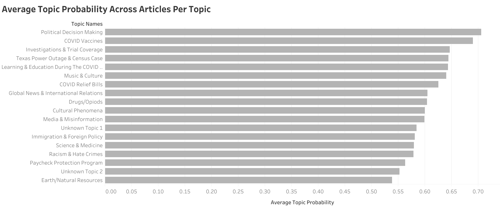
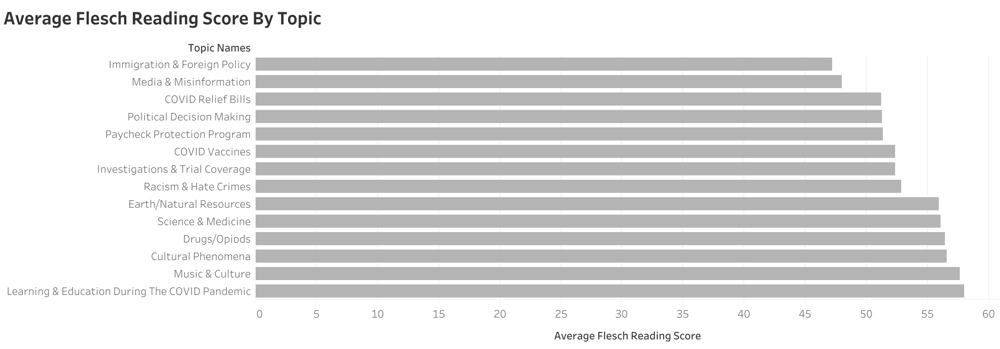
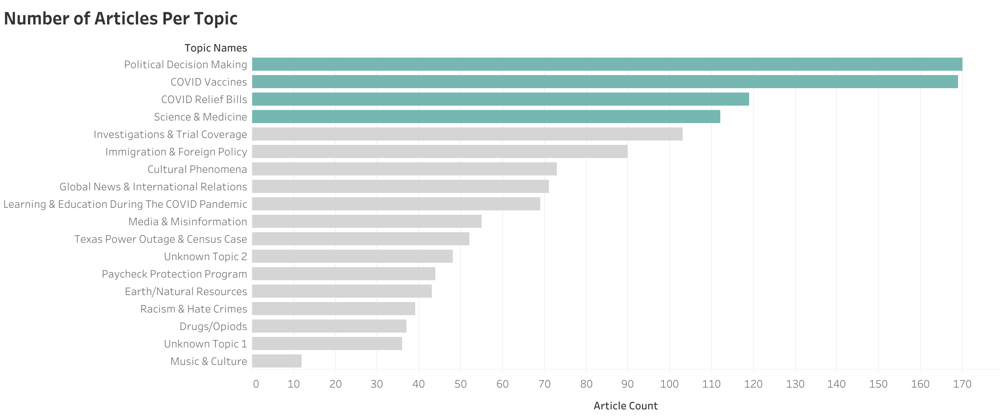

# **PREDICTING DIABETES IN ICU PATIENTS**
Leslie Cardone  
May 27, 2021  
Metis: NLP and Unsupervised Learning

## ABSTRACT

As a learner of a second language, I have experienced the difficulty in breaking free of text book learning and diving into literature written by and for native speakers of my target language. It can also be a challenge to find interesting materials that match my reading level.

With this in mind, I aim to analyze text complexity by topic of recent NPR news stories so that learners of English as a second language can find short, relevant reading materials to help improve their language ability. 

## DATA

The articles and corresponding data for this project come from [NPR](https://www.npr.org/sections/news/archive). 

There are 1,344 news stories with 132 unique category tags. The stories were written from December 2020 to May 23, 2021. 

The mean word count for these articles is 1,431 words per article, with a mean of 59 sentences.

I avoided articles that were transcripts of podcasts.

## DESIGN

*TOPIC MODELING*   
I processed my text by removing duplicate sentence artifacts. I tried both count vectorization and TF-IDF to create my feature matrix. I found that TF-IDF lead to the creation of "word soup" topics further down the pipeline.

My final topic model was engineered with a count vectorizer (80% maximum document frequency, in at least 3 documents) in conjunction with Latent Dirichlet  Allocation.

I chose 18 topics to catch some specific  themes that did not otherwise present in a smaller amount of topics. Furthermore, 18 was the threshold before documents were assigned to a topic with less than .95 probability of belonging to that topic.

*TEXT COMPLEXITY*   
I analyzed text complexity and reading level using Flesch Reading Ease scores. The Flesch Reading Ease gives a text a score between 1 and 100, with 100 being the highest readability score. 

## ALGORITHMS/TOOLS

*LIBRARIES*
- Numpy and Pandas for data manipulation
- nltk for tokenizing sentences and words
- sklearn.feature_extraction.text CountVectorizer to create the sparse matrix
- sklearn.decomposition LDA for topic modeling
- textstat for text complexity analysis
- Tableau for visualizations

## COMMUNICATION
*VISUALIZATIONS*
1. Average Topic Probabilities Across Articles

2. Average Flesch Reading Ease Score By Topic:

3. Number of Articles per Topic   
NPR is reporting heavily on politics and COVID

